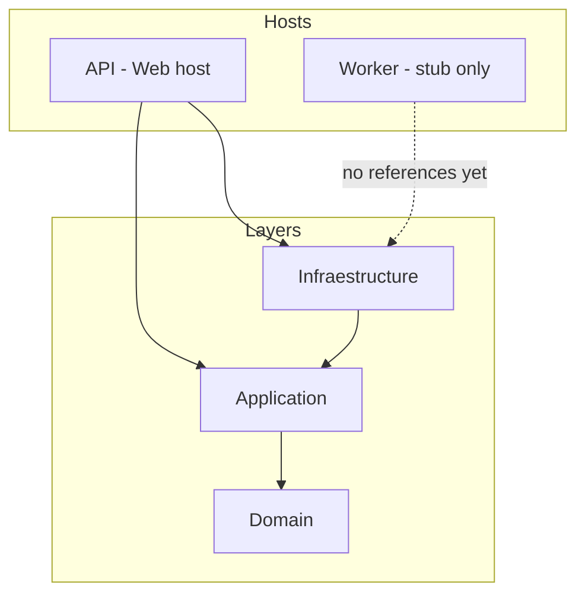
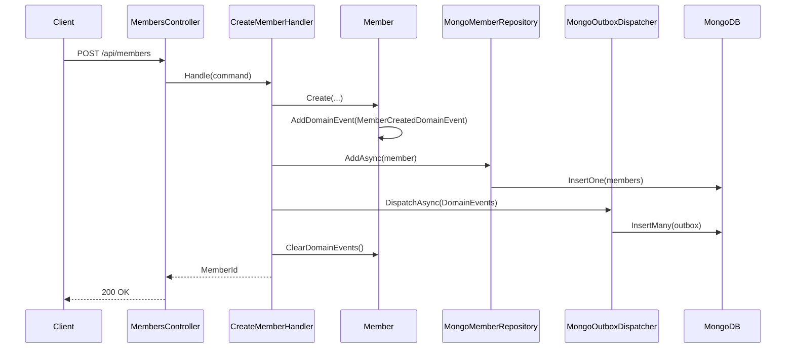

# Lotus Foundation — Architecture Brief (English)

Share this document with your PM/architect co-pilot. It describes **what exists today** on branch `feature/domain-events-and-outbox`, not a future roadmap unless noted as a gap.

---

## 1. Purpose and scope

**Lotus Foundation** is a .NET 8 backend for managing **members** in a hierarchical organization. The domain language is Spanish (division names, org fields like `Territorio`, `SubDireccion`), but the codebase and APIs are standard C# / REST.

**Current product scope (implemented):**
- Create a member via HTTP POST
- Persist members in MongoDB
- Capture domain events in an **outbox** collection for later async processing

**Planned but not implemented (stubs / empty folders):**
- Meetings, notifications, general events (`Event`, `Meeting`, `Notification` are empty internal classes)
- Outbox **consumer** (worker polls and processes messages)
- Queries, additional commands, auth, transactional outbox

---

## 2. Technology stack

| Area | Choice |
|------|--------|
| Runtime | .NET 8 |
| API | ASP.NET Core Web API, controllers, Swagger |
| Persistence | MongoDB (`MongoDB.Driver` 3.5.2) |
| Architecture | Clean Architecture / onion (Domain → Application → Infrastructure) |
| Hosting | API project is the composition root; Dockerfile present |
| Background work | `Worker` project scaffolded (`BackgroundService`), **not hosted yet** |

**Repo layout:** solution at [`lotus-foundation/lotus-foundation.sln`](lotus-foundation/lotus-foundation.sln), all projects under [`lotus-foundation/`](lotus-foundation/).

---

## 3. Solution structure and dependencies

| Project | Path | References | Role |
|---------|------|------------|------|
| **Domain** | [`Domain/`](lotus-foundation/Domain/) | none | Entities, aggregates, domain events |
| **Application** | [`Application/`](lotus-foundation/Application/) | Domain | Use cases, ports (`IMemberRepository`, `IDomainEventDispatcher`) |
| **Infraestructure** | [`Infraestructure/`](lotus-foundation/Infraestructure/) | Application | Mongo repos, outbox writer, BSON mapping |
| **API** | [`API/`](lotus-foundation/API/) | Application + Infraestructure | HTTP API, **composition root** (all DI) |
| **Worker** | [`Worker/`](lotus-foundation/Worker/) | none | Intended outbox processor; **isolated stub** |

**Note:** Project folder is spelled `Infraestructure` (typo preserved in codebase).

**DI entry points:** only [`API/Program.cs`](lotus-foundation/API/Program.cs) and [`API/DependencyInjection.cs`](lotus-foundation/API/DependencyInjection.cs). No `Program.cs` in Worker.

---

## 4. Architectural principles in practice

- **Domain-centric model:** business rules and events live on aggregates (`Member`), not in controllers.
- **Ports and adapters:** Application defines interfaces; Infrastructure implements them.
- **Explicit use cases:** one handler per command (`CreateMemberHandler`), not generic MediatR yet.
- **Domain events + transactional outbox (partial):** events are raised in the aggregate, then written to Mongo `outbox` after persistence. **Not atomic** today (two separate writes).
- **Strong typing for IDs:** `MemberId` is a `readonly struct` wrapping `Guid`.

---

## 5. Domain model

### 5.1 Core aggregate: `Member`

Location: [`Domain/Members/Member.cs`](lotus-foundation/Domain/Members/Member.cs)

| Concept | Type | Notes |
|---------|------|-------|
| Identity | `MemberId` | `MemberId.New()`, rejects empty GUID |
| Name | `FullName` | Validated first/last name |
| Division | `Division` enum | Futuro, JuvenilMasculina, JuvenilFemenina, DamasJovenes, Damas, Caballeros |
| Role | `MemberRole` enum | Miembro, Encargado, Responsable |
| Status | `MemberStatus` enum | Active (default), Inactive |
| Org structure | `OrganizationUnit` | Territorio, SubDireccion, optional Zona, Provincia |
| Lifecycle | `CreatedAt` | UTC at construction |

**Factory:** `Member.Create(...)` sets status Active, timestamps, and raises `MemberCreatedDomainEvent`.

**Behaviors (no events yet):** `ChangeRole`, `Deactivate`, `AssignRole`.

**Base class:** [`AggregateRoot`](lotus-foundation/Domain/Common/AggregateRoot.cs) collects `DomainEvents`, supports `ClearDomainEvents()`.

### 5.2 Domain events

| Event | When raised | Payload |
|-------|-------------|---------|
| `MemberCreatedDomainEvent` | `Member.Create` | `MemberId`, `OccuredOn` (UTC) |

Interface: [`IDomainEvent`](lotus-foundation/Domain/Common/IDomainEvent.cs) with `DateTime OccuredOn`.

Only **one** domain event exists. Role changes and deactivation do **not** emit events yet.

### 5.3 Placeholder entities

`Event`, `Meeting`, `Notification` under [`Domain/Entities/`](lotus-foundation/Domain/Entities/) are empty stubs. Csproj includes empty folders for future modules (Meetings, Notifications, DomainRules).

---

## 6. Application layer

### 6.1 Ports

| Interface | File | Contract |
|-----------|------|----------|
| `IMemberRepository` | [`Application/Interfaces/IMemberRepository.cs`](lotus-foundation/Application/Interfaces/IMemberRepository.cs) | `AddAsync`, `GetByIdAsync`, `ExistsAsync` |
| `IDomainEventDispatcher` | [`Application/Common/IDomainEventDispatcher.cs`](lotus-foundation/Application/Common/IDomainEventDispatcher.cs) | `DispatchAsync(IEnumerable<IDomainEvent>, ct)` |

### 6.2 Use case: Create Member

**Command:** [`CreateMemberCommand`](lotus-foundation/Application/Members/CreateMember/CreateMemberCommand.cs) — record with name, division, role, org fields.

**Handler:** [`CreateMemberHandler`](lotus-foundation/Application/Members/CreateMember/CreateMemberHandler.cs)

Sequence:
1. Generate `MemberId.New()`
2. Guard duplicate ID (unlikely but checked)
3. `Member.Create(...)` → attaches `MemberCreatedDomainEvent`
4. `IMemberRepository.AddAsync(member)`
5. `IDomainEventDispatcher.DispatchAsync(member.DomainEvents)`
6. `member.ClearDomainEvents()`
7. Return `MemberId`

---

## 7. Infrastructure layer

### 7.1 MongoDB setup

- **Config:** `Mongo` section in appsettings → [`MongoSettings`](lotus-foundation/Infraestructure/Persistence/Mongo/MongoSettings.cs)
- **Client:** [`MongoContext`](lotus-foundation/Infraestructure/Persistence/Mongo/MongoContext.cs) (singleton)
- **BSON:** [`MongoConfiguration`](lotus-foundation/Infraestructure/Persistence/Mongo/MongoConfiguration.cs), [`MongoMappings`](lotus-foundation/Infraestructure/Persistence/Mongo/MongoMappings.cs)
- **Health:** [`MongoHealthCheck`](lotus-foundation/Infraestructure/Persistence/Mongo/MongoHealthCheck.cs) exposed via [`HealthController`](lotus-foundation/API/Controllers/HealthController.cs)

### 7.2 Members collection

| Item | Detail |
|------|--------|
| Collection name | `members` |
| Repository | [`MongoMemberRepository`](lotus-foundation/Infraestructure/Persistence/Repositories/MongoMemberRepository.cs) |
| Serialization | Custom [`MemberSerializer`](lotus-foundation/Infraestructure/Persistence/Mongo/Serializers/MemberIdSerializer.cs) + [`MemberSurrogate`](lotus-foundation/Infraestructure/Persistence/Mongo/Surrogates/MemberSurrogates.cs) |
| Document key | `_id` = `MemberId.Value` (Guid) |

Domain events are **not** stored on the member document.

### 7.3 Outbox collection (write path)

| Item | Detail |
|------|--------|
| Collection name | `outbox` |
| Writer | [`MongoOutboxDispatcher`](lotus-foundation/Infraestructure/Outbox/MongoOutboxDispatcher.cs) |
| Document type | [`OutboxMesage`](lotus-foundation/Infraestructure/Outbox/OutboxMesage.cs) *(typo: "Mesage")* |

**Outbox document shape:**
- `Id` — new Guid per message
- `Type` — CLR type name, e.g. `"MemberCreatedDomainEvent"`
- `Payload` — JSON-serialized event (`System.Text.Json`)
- `OccuredOn` — from domain event
- `ProcessedOn` — nullable; **never set on write**; reserved for worker

---

## 8. API surface

| Endpoint | Controller | Behavior |
|----------|------------|----------|
| `POST /api/members` | [`MembersController`](lotus-foundation/API/Controllers/Members/MembersController.cs) | Body = `CreateMemberCommand`, returns `200 OK` (no body with created id today) |
| Health | [`HealthController`](lotus-foundation/API/Controllers/HealthController.cs) | Mongo connectivity check |

**Pipeline:** Swagger (dev) → HTTPS → authorization (no auth implemented) → controllers.

---

## 9. End-to-end flow (Create Member + Outbox)

---

## 10. Worker and outbox consumption (not built)

[`OutboxProcessor`](lotus-foundation/Worker/OutboxProcessor.cs) extends `BackgroundService` but `ExecuteAsync` returns immediately — **no polling, no handlers, no host**.

**Worker gaps:**
- No `Program.cs` / generic host
- No project references to Infrastructure or Application
- Not registered in DI anywhere
- `ProcessedOn` never updated

**Intended direction (inferred):** separate process polls `outbox` for unprocessed messages, deserializes by `Type`, invokes integration handlers (email, projections, etc.), marks `ProcessedOn`.

---

## 11. Known limitations and technical debt

1. **No transactional outbox** — member insert and outbox insert are separate operations; failure between them can cause inconsistency.
2. **Outbox consumer missing** — messages accumulate with no processor.
3. **Worker not wired** — solution includes Worker project but it does not run.
4. **API does not return created resource** — handler returns `MemberId` but controller returns empty `Ok()`.
5. **Single event only** — most aggregate behaviors do not publish domain events.
6. **Naming typos** — `Infraestructure`, `OutboxMesage`, `OccuredOn` (throughout domain and outbox).
7. **No authentication/authorization** on API.
8. **No CQRS read models** — only create path exists.
9. **Placeholder domain modules** — meetings, notifications not started.

---

## 12. Active branch context

Git branch: `feature/domain-events-and-outbox`

Recent work adds:
- Domain event dispatch port and Mongo outbox writer
- `CreateMemberHandler` integration with dispatcher
- `Worker` project + `OutboxProcessor` stub
- Solution and DI updates in API

**Maturity:** outbox **write path** is in place; **read/process path** is the main next architectural piece.

---

## 13. Suggested co-pilot conversation starters

For your PM + architect ChatGPT session, useful prompts:

- "Design the OutboxProcessor: polling strategy, idempotency, failure/retry, and how to map `Type` + `Payload` to handlers."
- "Should member + outbox writes use Mongo multi-document transactions? What are the tradeoffs for this scale?"
- "What domain events should `ChangeRole` and `Deactivate` emit, and what downstream integrations do we need?"
- "Define API contract improvements: return `201` with `MemberId`, validation errors, OpenAPI examples."
- "Roadmap empty modules: Meetings, Notifications — bounded contexts and boundaries vs single Mongo database."

---

## 14. Key file index (for navigation)

| Concern | File |
|---------|------|
| Aggregate | [`Domain/Members/Member.cs`](lotus-foundation/Domain/Members/Member.cs) |
| Domain event | [`Domain/Members/Events/MemberCreatedDomainEvent.cs`](lotus-foundation/Domain/Members/Events/MemberCreatedDomainEvent.cs) |
| Create use case | [`Application/Members/CreateMember/CreateMemberHandler.cs`](lotus-foundation/Application/Members/CreateMember/CreateMemberHandler.cs) |
| HTTP entry | [`API/Controllers/Members/MembersController.cs`](lotus-foundation/API/Controllers/Members/MembersController.cs) |
| DI / composition | [`API/DependencyInjection.cs`](lotus-foundation/API/DependencyInjection.cs) |
| Member persistence | [`Infraestructure/Persistence/Repositories/MongoMemberRepository.cs`](lotus-foundation/Infraestructure/Persistence/Repositories/MongoMemberRepository.cs) |
| Outbox write | [`Infraestructure/Outbox/MongoOutboxDispatcher.cs`](lotus-foundation/Infraestructure/Outbox/MongoOutboxDispatcher.cs) |
| Worker stub | [`Worker/OutboxProcessor.cs`](lotus-foundation/Worker/OutboxProcessor.cs) |
